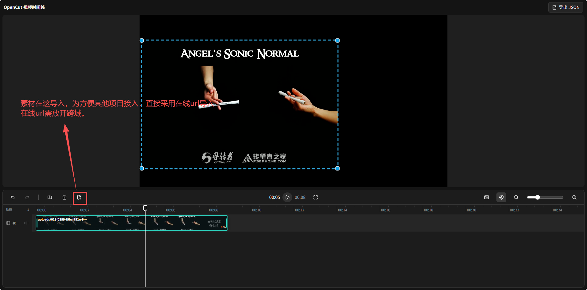

# EaseCut React

EaseCut React 是一个独立、可嵌入的 React 视频时间线编辑器。它提供多视频/音频/文字轨、拖拽编排、裁剪、分割、吸附、撤销重做、固定倍速、音量调节、画面变换、文字标题预览以及可扩展导出接口。

项目不依赖 React Flow、Tailwind、shadcn 或 Base UI。界面由语义 HTML、普通 CSS、原生 Canvas 和 lucide-react 构成。

> 当前包名为 `easecut-react`，并设置了 `private: true`。这是为了先稳定公开 API；正式发布到 npm 前需要确认包名和版权主体。

## 本地开发

要求 Node.js `^20.19.0` 或 `>=22.12.0`，推荐 Node.js 22。

```bash
npm install
npm run dev
```

打开 Vite 输出的地址，通过顶部的“添加本地素材”选择浏览器支持的本地视频或音频文件即可体验。

常用命令：

```bash
npm run lint
npm run typecheck
npm run test
npm run build
npm run preview
```

`npm run build` 会同时生成：

- `dist/`：ESM 组件库、TypeScript 声明和 `styles.css`。
- `demo-dist/`：可部署的示例应用。

## 组件用法

```tsx
import {
  VideoTimelineEditor,
  type VideoTimelineDraft,
  type VideoTimelineSource,
} from 'easecut-react';
import 'easecut-react/styles.css';

const sources: VideoTimelineSource[] = [
  {
    id: 'video-1',
    type: 'video',
    fileName: 'example.mp4',
    src: 'https://example.com/example.mp4',
    durationUs: 8_500_000,
    width: 1920,
    height: 1080,
  },
];

export function Editor() {
  const saveDraft = (draft: VideoTimelineDraft) => {
    localStorage.setItem('timeline-draft', JSON.stringify(draft));
  };

  return (
    <div style={{ height: 720 }}>
      <VideoTimelineEditor
        onDraftChange={saveDraft}
        onExport={async ({ draft, payload }) => {
          // 将 payload 交给自己的服务端视频渲染服务。
          await submitRenderTask({ draft, payload });
        }}
        sources={sources}
        title='我的视频工程'
      />
    </div>
  );
}
```

`initialDraft` 只在组件实例创建时读取。切换工程时请为组件设置新的 React `key`。`onDraftChange` 只响应可持久化的轨道、片段和画布变化，不会因播放时间、缩放或选中状态触发。

`VideoTimelineDraft.tracks` 使用从合成底层到顶层的数组顺序，且每条轨道的
`zIndex` 等于数组下标。轨道固定规范化为 `[音频…, 视频…, 文字…]`：
`tracks[0]` 是最低层，最后一条轨道是最高层；主视频是视频组的最低层。
时间线会反向展示该数组，因此最高层显示在顶部、音频显示在底部，符合
“上方轨道覆盖下方轨道”的剪辑软件习惯。

## 媒体源

视频源建议提供时长、宽度和高度；音频源建议提供时长。如果缺失，编辑器会通过浏览器媒体元素异步读取。

配置 `onImportMedia` 后，在线素材弹窗会根据 URL 路径中的文件后缀自动识别视频或音频，无需用户选择类型；查询参数和签名不会影响识别。

```ts
type VideoTimelineSource = {
  id: string;
  type: 'video' | 'audio';
  fileName: string;
  src: string;
  waveformSrc?: string;
  durationUs?: number;
  width?: number;
  height?: number;
};
```

后续向 `sources` 加入新 ID 会将素材追加到当前时间线。移除 source 不会自动删除已编辑片段，避免宿主数据刷新导致工程内容丢失。

项目草稿只接受 `schemaVersion: 10`，旧 schema 会被明确拒绝且不会自动迁移。草稿中的
`startUs`、`durationUs`、`sourceDurationUs`、`trimStartUs` 和 `trimEndUs`
均为整数微秒；浏览器媒体元素使用的浮点秒只在媒体边界换算。
每个 clip 持有独立的 `volume`（`0` 至 `1`）；轨道仅持有 `muted`，静音时不会改写
clip 的已保存音量。

工具栏“添加标题”会从当前播放头创建一个默认 5 秒的文字 Clip；即使超出主视频结尾，也会延长项目时长。文字 Clip 保存标题内容、`FontType`、字号、`#RRGGBBAA` 颜色、`bold`、`italic`、`underline`、可编辑的 `position` 和系统测量得到的 `layoutSize`，不会保存虚假的媒体 Source。默认样式为思源黑体、120 px、白色，粗体、斜体和下划线均关闭，并以文字自然尺寸放置在画布中心。文字始终保持单行，不能手动调整宽高；修改内容、字体、字号、粗体或斜体时会重新测量并保持中心点不变，下划线不改变自然尺寸，超出画布的部分只由组合画布边界裁切。内置字体没有独立样式文件时，粗体和斜体由浏览器合成。

当前字体预设固定为站酷仓耳渔阳体、站酷高端黑、站酷酷黑体、站酷快乐体、站酷文艺体、站酷小薇体、思源黑体和阿里巴巴普惠体，不包含方正字体。八款字体均随组件库打包并按需加载。

每个音视频 clip 还必须持有 `speed`，取值范围为 `0.1` 至 `4`，新建 clip
默认为 `1`。倍速作用于裁剪后的源区间，`durationUs` 是变速后的时间线时长；
修改倍速会保持 clip 起点和裁剪范围，并联动平移同轨后续片段。
音视频预览会优先通过 AudioWorklet 和 SoundTouch 对媒体原声进行实时音调补偿，
使变速主要改变时长并保持原音调；浏览器不支持 AudioWorklet 时会显示降级提示，
并回退到 `preservesPitch`。视频 Canvas 优先由
`requestVideoFrameCallback` 驱动，播放期间不会按时间线动画帧反复 seek；
每条轨道还会预加载五秒内的下一个 clip，减少连接点等待。慢放只延长现有视频帧，
不执行光流插帧，因此低帧率素材在极慢速下仍会看到重复帧。

## 私有媒体加载

默认加载器执行不带 token、cookie 或自定义 header 的 `fetch`。私有媒体可以注入加载器：

```tsx
<VideoTimelineEditor
  mediaLoader={{
    async loadBlob(url, { signal }) {
      const response = await fetch(url, {
        signal,
        headers: { Authorization: `Bearer ${token}` },
      });
      if (!response.ok) throw new Error('媒体加载失败');
      return response.blob();
    },
  }}
  sources={sources}
/>
```

同一编辑器实例会复用 Blob、Object URL、波形、帧预览和元数据缓存；卸载时会中止未完成请求并释放 Object URL。不同编辑器实例之间不会共享这些资源。

时间线帧预览在独立 Worker 中使用 Mediabunny `CanvasSink.canvasesAtTimestamps()` 按当前时间线密度批量解码，并将 48px 高的 OffscreenCanvas 编码为 JPEG 缩略图；任务取消或编辑器卸载时会释放 Worker、Mediabunny 输入资源和生成的 Object URL。该能力要求浏览器支持 Worker、OffscreenCanvas 和 WebCodecs。

音频波形会优先在独立 Worker 中使用 Mediabunny 分段解码；每个解码样本会立即聚合为归一化峰值并释放，不会在主线程保留整段 PCM。运行时销毁会同步取消解码；容器、编码格式或浏览器能力不支持时，自动回退到 `AudioContext.decodeAudioData()`。

Mediabunny 负责媒体解封装、缩略图和波形解码，不承担实时音频 time-stretch。
保持音调的预览处理使用 `@soundtouchjs/audio-worklet`，音频节点、处理器和
`AudioContext` 均随编辑器预览实例创建并在卸载时释放。

## 导出

- “导出 JSON”下载当前 `CompositionExportPayload`。
- 传入 `onExport` 后显示“导出视频”，回调会收到最新 `draft` 和 `payload`。
- EaseCut React 不包含 MP4 编码器或渲染后端。
- 可使用 `createCompositionExportPayload(draft)` 在组件外创建同样的导出数据。
- `CompositionExportPayload.Track` 与草稿采用相同的从下到上顺序：
  `Track[0]` 是最低层，最后一个 Track 是最高层。
- 每个音视频导出元素都会包含 `{ Type: 'speed', Speed }`。视频过滤器顺序为
  `trim → speed → transform → a_volume`，音频过滤器顺序为
  `a_volume → trim → speed`。
- 文字导出元素包含 `Type`、`TargetTime`、`Text`、`FontType`、`FontSize`、`FontColor`、`Bold`、`Italic`、`Underline` 以及唯一的 `transform` Extra；三个样式字段始终显式输出布尔值，其中 Width、Height 来自自然尺寸测量，不包含 `AlignType` 或媒体专属的 `Source`、`trim`、`speed`、`a_volume`。
- 草稿只读取当前 schema v10，不迁移旧版本。

## 快捷键

快捷键仅作用于当前获得焦点的编辑器实例：

| 操作 | 快捷键 |
| --- | --- |
| 撤销 | `Ctrl/Cmd + Z` |
| 重做 | `Ctrl + Y` 或 `Cmd + Shift + Z` |
| 复制片段 | `Ctrl/Cmd + C` |
| 粘贴片段 | `Ctrl/Cmd + V` |
| 分割片段 | `Ctrl/Cmd + B` |
| 删除片段 | `Backspace` |
| 播放/暂停 | `Space` |
| 缩放时间线 | `Ctrl + 滚轮` |

## 浏览器限制

- 面向现代桌面浏览器，不支持 SSR、React Native 或移动端触控剪辑。
- 远程媒体必须允许 CORS，并使用浏览器支持的封装和编解码格式。
- 音频波形的 WebCodecs 加速需要安全上下文和浏览器可用的音频解码器；不满足时会使用 `AudioContext.decodeAudioData()`。
- Canvas 预览是编辑体验，不等同于最终离线渲染结果。

## License

[MIT](./LICENSE)
